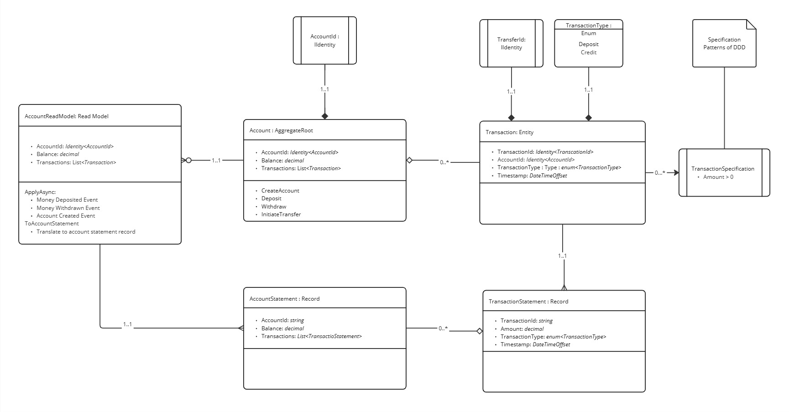

# Domain Model

Leveraging the concepts found in **DDD** _(Domain Driver Design)_  and Event Sourcing, the following domain model was established. This model do not present the CQRS elements, such as commands and events, as those are described in another sections.

<figure><picture><source srcset="../../.gitbook/assets/domainmodeldm.jpg" media="(prefers-color-scheme: dark)"></picture><figcaption>
Domain Model
</figcaption></figure>

### Core Domain Concepts

#### **Design Patterns and DDD Concepts**

1. **Aggregate and Entity Patterns**
   * The [`Account`](accountaggregate.md) acts as the aggregate root, enforcing business invariants and coordinating changes across [`Transaction`](transaction.md) entities.
2. **Specification Pattern**
   * The `TransactionSpecification` encapsulates domain rules, such as ensuring valid transaction amounts, improving the reusability and testability of the rules.
3. **Event Sourcing**
   * Changes in the domain are captured as immutable events stored in an event store, allowing reconstruction of the aggregate's state by replaying events.
4. **CQRS**
   * The separation of command (write) and query (read) models ensures scalability, with the read models optimized for querying and the command models for domain logic execution.

### Read Model

The [`AccountReadModel`](accountreadmodel.md) is a key component in implementing the **read side** of the Event Sourcing and Command Query Responsibility Segregation (CQRS) pattern. This read model listens to domain events and updates its state accordingly, providing a queryable projection of an account's current balance and transaction history.
