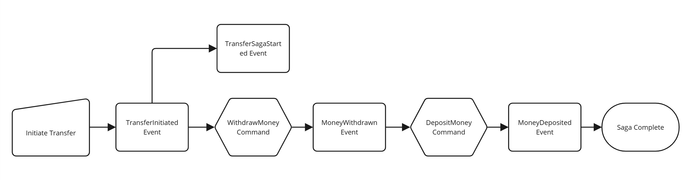

# Transfer Saga

<figure><picture><source srcset="../.gitbook/assets/transfer-event-dm.jpg" media="(prefers-color-scheme: dark)"></picture><figcaption>
Transfer Event Flow
</figcaption></figure>

1. User initiates the transfer between two accounts
2. A [**TransferInitiated** ](events/transferinitiated.md)Event is emitted from Account Aggregate, handled by **TransferSaga**, which:
   1. Emits [**TransferSagaStarted** ](events/transfersagastarted.md)**Event** which stores the saga information in Saga Aggregate
   2. Published [**WithdrawMoney** ](commands/withdrawmoney.md)Command for source Account
3. Withdrawal command results in [**MoneyWithdrawn** ](events/moneywithdrawn.md)Event being emitted by the account aggregate, which:
   1. Gets picked up by the **TransferSaga** and connected with the rest of the processing paradigm
   2. Transfer Saga published [**DepositMoney** ](commands/depositmoney.md)command to target Account.
4. [**MoneyDeposited** ](events/moneydeposited.md)event is issued&#x20;
5. **TransferSaga** handles [**MoneyDeposited** ](events/moneydeposited.md)Event and **completes.**
