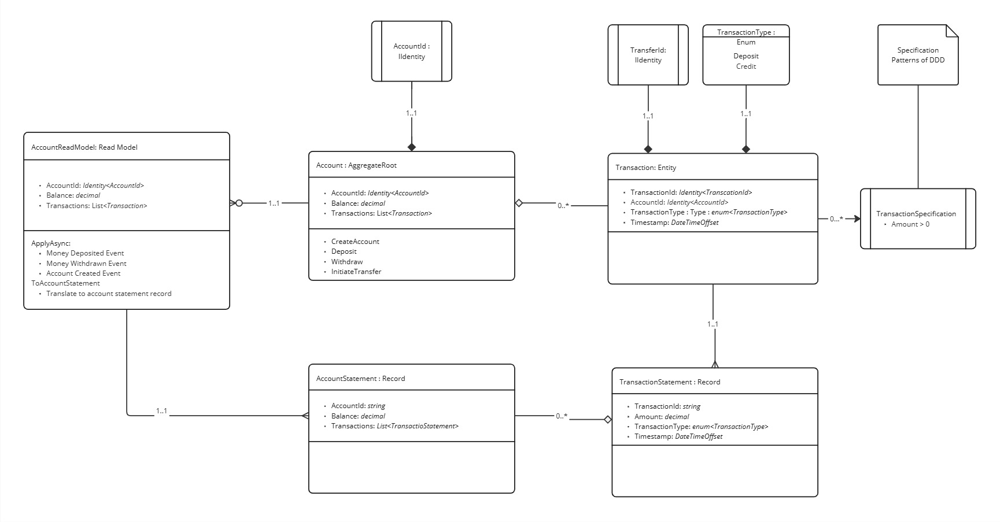

# Domain Model

Leveraging the concepts found in **DDD** _(Domain Driver Design)_  and Event Sourcing, the following domain model was established. This model do not present the CQRS elements, such as commands and events, as those are described in another sections.

<figure><picture><source srcset="../.gitbook/assets/domainmodeldm.jpg" media="(prefers-color-scheme: dark)"></picture><figcaption>
Domain Model
</figcaption></figure>

### Core Domain Concepts

Core Domain Concepts

1.  **Account Aggregate Root**

    * **Purpose:** Represents the primary business entity in the banking domain.
    * **Attributes:**
      * `AccountId`: A unique identifier for the account, represented as an `Identity<AccountId>` type.
      * `Balance`: Tracks the current balance of the account (decimal).
      * `Transactions`: A collection of `Transaction` entities associated with this account.
    * **Responsibilities (Methods):**
      * `CreateAccount`: Initializes a new account.
      * `Deposit`: Handles adding funds to the account.
      * `Withdraw`: Handles removing funds from the account.
      * `InitiateTransfer`: Supports initiating a transfer to another account.

    This aggregate ensures that business rules, such as maintaining account integrity and balance updates, are encapsulated within the domain logic.

    * **Transaction Entity**
      * **Purpose:** Represents a specific transaction within an account (e.g., deposit, withdrawal).
      * **Attributes:**
        * `TransactionId`: A unique identifier for the transaction, represented as `Identity<TransactionId>`.
        * `AccountId`: Links the transaction to the `Account` aggregate.
        * `TransactionType`: An enumeration (`enum<TransactionType>`) that defines the type of transaction (Deposit, Credit).
        * `Timestamp`: Records the date and time of the transaction.
      * **Relationship with `Account`:**
        * The `Account` aggregate maintains a collection of `Transaction` entities, adhering to the _0.._ cardinality, indicating multiple transactions can exist for an account.
    * **TransactionType (Enum)**
      * Enumerates possible transaction types:
        * `Deposit`
        * `Credit`
    * **Transaction Specification**
      * **Purpose:** Implements a specification pattern to enforce domain constraints.
      * **Rule:** The `TransactionSpecification` ensures that any transaction has a positive amount (`Amount > 0`).

### Read Model

The `AccountReadModel` is a key component in implementing the **read side** of the Event Sourcing and Command Query Responsibility Segregation (CQRS) pattern. This read model listens to domain events and updates its state accordingly, providing a queryable projection of an account's current balance and transaction history.

**Key Components**

1. **Properties**
   * `AccountId`: Represents the unique identifier of the account.
   * `Balance`: Stores the current balance of the account.
   * `Transactions`: A collection of `Transaction` objects representing the history of account transactions.
2. **Event Handlers** The `AccountReadModel` subscribes to the following domain events emitted by the `AccountAggregate`:
   * **`AccountCreatedEvent`**
     * Initializes the `AccountReadModel` with a new account's `AccountId`, sets the initial balance to 0, and creates an empty transaction list.
   * **`MoneyDepositedEvent`**
     * Adds a `Transaction` object to the `Transactions` list, reflecting the deposited amount.
     * Updates the `Balance` by adding the deposited amount.
   * **`MoneyWithdrawnEvent`**
     * Adds a `Transaction` object to the `Transactions` list, reflecting the withdrawn amount.
     * Updates the `Balance` by subtracting the withdrawn amount.
